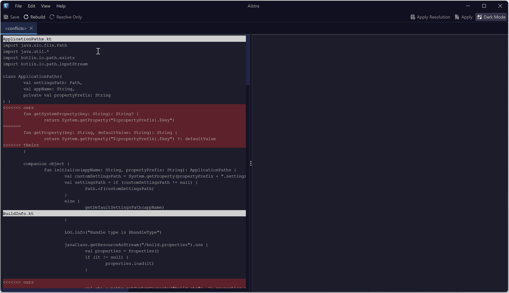
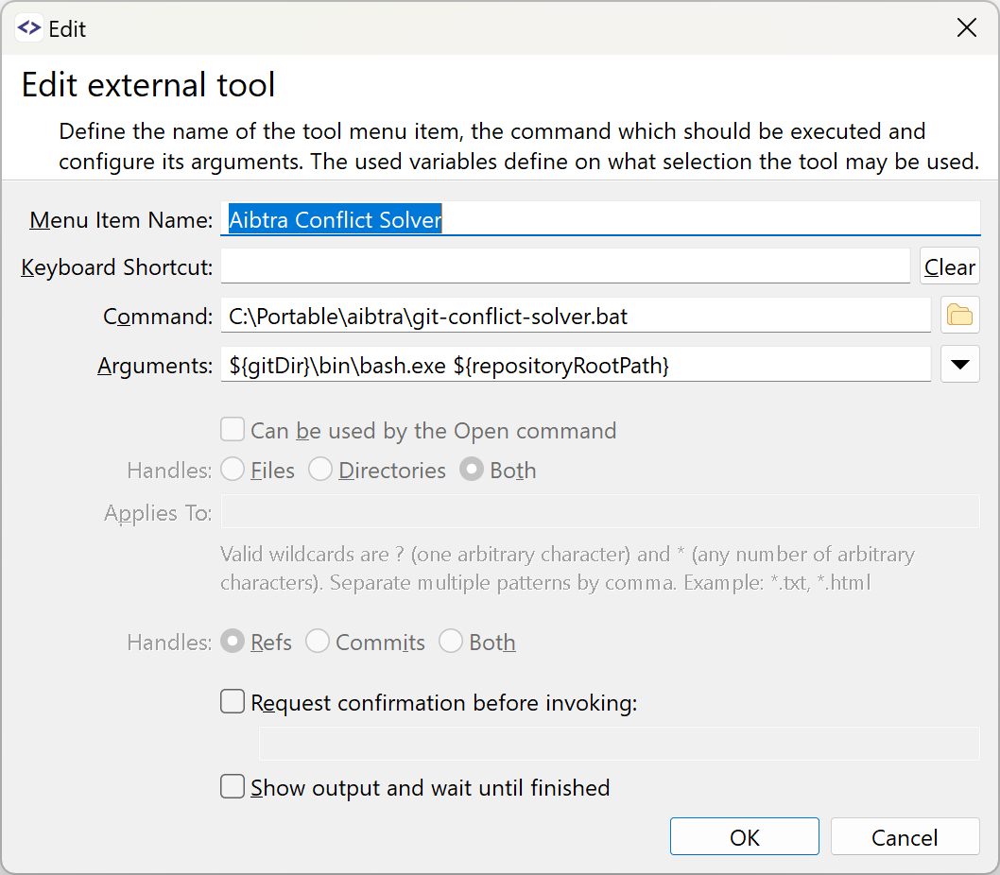

Git conflicts are a common headache, often arising from simultaneous edits to the same code. For instance, one developer might rename a method while another adds a new parameter. These conflicts are typically more about analyzing syntax than understanding the code's deeper purpose, making them a great candidate for AI assistance.

[OpenAI's o1-mini model](https://openai.com/index/openai-o1-mini-advancing-cost-efficient-reasoning/){:target="_blank"} is known to perform well in programming and/or analytical tasks and thus is a promising candidate for tackling these kinds of challenges. Aibtra now offers a basic interface to experiment with AI-based Git conflict resolution.



*The video above shows the process sped up.*

## Getting hands on (Windows and Linux only)

> ##### NOTE
>
> This is an experimental tool and not a production-ready AI conflict resolver. It works well enough for experimenting with conflict resolution, and there's no risk of harm (details below). It may be most beneficial when used alongside manual conflict resolution and can help quickly sort out simpler conflicts.

To give the conflict resolver a try, get the latest [experimental build](https://github.com/aibtra/aibtra/releases/tag/experimental){:target="_blank"} from GitHub:

- [Windows (zip)](https://github.com/aibtra/aibtra/releases/download/experimental/aibtra-experimental-windows.zip)
- [Linux (tar.gz)](https://github.com/aibtra/aibtra/releases/download/experimental/aibtra-experimental-linux.tar.gz)

The entry scripts are `git-conflict-solver.bat` (and `git-conflict-solver.sh`, respectively).
A typical configuration in a GUI client, like [SmartGit](https://www.syntevo.com/smartgit/){:target="_blank"}, will look like:

{: .small-image}

The conflicts you resolve are stored in memory until you choose to save them. Aibtra doesn't automatically stage the resolutions, so if you dislike the outcome or if something else goes awry, you can easily [restore the original conflict](https://stackoverflow.com/a/14409744/241453){:target="_blank"} and start over with:

```
git checkout --merge FILE
```

It's also beneficial to have a robust IDE that can reformat code immediately after resolving conflicts, as indentations are often problematic.

#### Temporary Files and housekeeping

The scripts will store temporary files in a sub-directory within your repository, located at `.git/aibtra`. It's a good idea to periodically clean up these directories.

## Experimental Results and Implementation Details

> ##### NOTE
>
> The current solution, including prompts, is the result of experimenting with OpenAI's `o1-mini-2024-09-12` model on real-world _Kotlin_ conflicts.

#### The Input: Code Snippets

When a conflict is detected, snippets of the code surrounding the conflict are submitted to the model. These include the `base`, `ours`, and `theirs` versions, along with the working tree file contents containing the conflict.

Why snippets instead of entire files? Conflicts are typically localized, and the crucial details are usually contained within the conflicting blocks and their immediate surroundings. Sending snippets:

1. minimizes the need to transmit large, potentially sensitive files (this may be a key factor for practical application in closed-source repositories),
2. reduces token costs,
3. and avoids encountering input size limits for the AI.

#### Bundling Conflicts Together

All conflicts are sent simultaneously because they are often interconnected. For instance, if a method is renamed and a parameter is added, you may encounter multiple conflicts across the codebase -- not just in the method declaration -- but also in every instance where the method is invoked. Sending related conflicts as a single, comprehensive request should help the AI understand the bigger picture.

#### The Resolution Process: 3 Key Stages

Using a single prompt to resolve conflicts, such as “Here are the files -- solve them” produced mixed results. To achieve more consistent and natural resolutions, the process is broken down into three stages:

1. **Analyze the Conflict**  
   The AI is given snippets and asked to describe the nature of the conflict in plain language. For instance, it might identify a simultaneous method rename and parameter addition.

2. **Generate Merge Instructions**  
   Without showing the snippets to the AI, it is asked to draft instructions for resolving the conflict based on its earlier analysis.

3. **Resolve the Conflict**  
   With the snippets and merge instructions, the AI is tasked with resolving the conflict while following the instructions.
   This step can be seen as the single (main) prompt mentioned above, but enriched with additional hints to direct the conflict resolution in a favorable direction.

## Challenges, Limitations, and Known Issues

The system currently faces several challenges, some likely arising from the model's capabilities and others from the present implementation of Aibtra.

#### Quality of Resolutions

The AI performs well with straightforward conflicts, but outcomes can be inconsistent with more complex issues. It shows promise but isn't a universal solution.

#### Speed

At present, the process involves completing three sequential stages, each of which is time-consuming. In many cases, manually resolving conflicts might be just as fast, if not more efficient. Enhancements in AI speed and accuracy are likely crucial for making this approach more practical in the future.

Implementing background-triggered resolutions by Git clients, along with effective management of these results and simultaneous manual conflict resolutions, presents another promising strategy to mitigate slow processing times.

#### Formatting Issues

- The AI doesn't always handle non-conflicting areas consistently. Sometimes it trims snippets too much; other times, it extends them unnecessarily. This inconsistency can make applying the resolution trickier.
- Because snippets are cut with a fixed context size, they sometimes lack key structural elements like braces, leading to indentation errors. Cutting snippets more intelligently (e.g., around method boundaries) could solve this, but such improvements require deeper language-specific understanding.
- The AI may sometimes report one large instead of individual _fenced code blocks_ for its results; this currently can't be parsed correctly.

#### Additional Observations

- The model consistently maintains and reports `CONFLICT-ID`s, which are essential for aligning the received results with the corresponding local files.

## Future Prospects

This experimental conflict solver represents a promising advancement in automating a traditionally tedious aspect of software development. While still in its early phases, it shows significant potential for the future. As AI continues to advance in speed and precision in handling syntactical tasks, conflict resolution may soon become effortless for software developers.