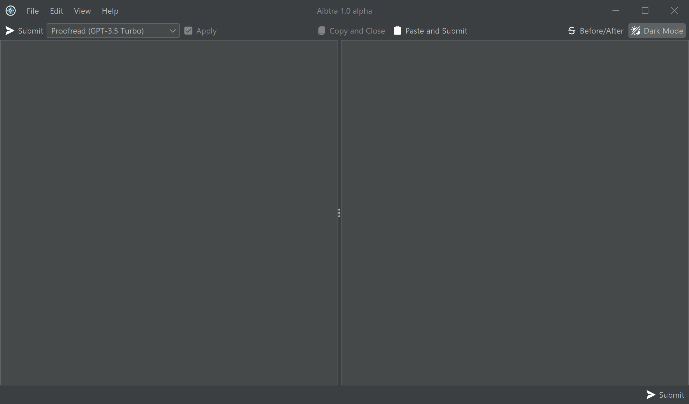

# Aibtra - a desktop tool to refine texts using OpenAI

> **Aibtra is in its early stages (alpha). Feedback is welcome at [GitHub](https://github.com/aibtra/aibtra).**

Aibtra is a small open-source desktop application that assists with reviewing and refining plaintext and markdown. It uses [OpenAI](https://openai.com)'s API along with predefined instructions internally.

Aibtra primarily aims to serve software developers and other tech-savvy users who frequently need to write short- to medium-sized texts, such as emails or technical documentation.

* [Binary Downloads](https://github.com/aibtra/aibtra/releases/tag/latest)
* [Source Code](https://github.com/aibtra/aibtra)

> **Note:** Aibtra utilizes OpenAI's API instead of ChatGPT. OpenAI's
> API comes with charges, so there may be notable costs incurred when
> extensively using Aibtra.

## Workflow

Aibtra's user interface is essentially a *diff* between your original text and its refined version. It includes a couple of optimizations to streamline a clipboard-focused workflow:

1. In your current application (such as a text editor or an email client), copy the text you want to refine to the clipboard.
2. Open Aibtra, paste the text, and send it to OpenAI.
3. Apply the suggested refinements concurrently while the refined text is being streamed. Skip those changes that you don't agree with.
4. Copy the refined text to the clipboard.
5. Back in your original application, paste the refined text from the clipboard.

## Sensitive Information

Aibtra parses markdown and can optionally replace quoted text (`>`) and text enclosed in `backticks` with placeholders before sending it to OpenAI. This simplifies excluding sensitive information from being sent to OpenAI.

No information whatsoever is transferred to Aibtra's servers.

## Contributing

Aibtra is open-source. It's written in Kotlin. You can contribute on [GitHub](https://github.com/aibtra/aibtra).

## Topics

- [Configuration](configuration.md)
- [Acknowledgments](acknowledgments.md)